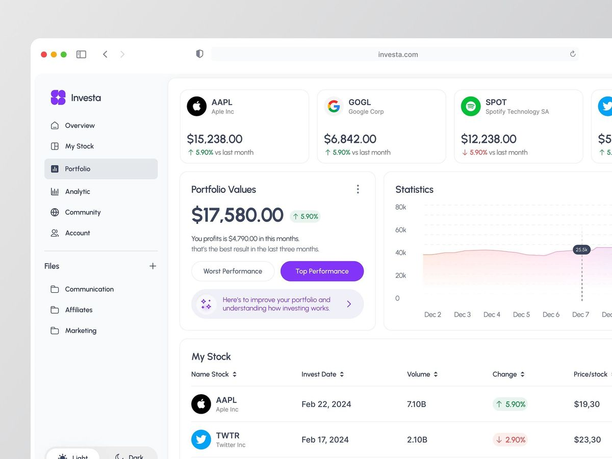

# Marketcap

A paper-trading web app in the style of Google Finance. Every user gets **$100,000 of virtual cash** to buy and sell real US stocks at live market prices — practice trading, track profit and loss, and learn to read candlestick charts, all risk-free with no real money involved.



## What the app does

- **Live dashboard** — your holdings as cards and a sortable table, each with the live price, today's change, market cap, and your profit/loss computed against what you paid. Prices auto-refresh every 60 seconds.
- **Stock search** — find any US stock by name or ticker with autocomplete. From the results you can open its detail page, quick-add it to your portfolio, or star it onto your watchlist.
- **Stock detail pages** (`/stock/AAPL`) — live price, an interactive TradingView-style chart with time ranges (1D/5D/1M/6M/1Y/5Y, down to 5-minute candles) and a line/candlestick toggle, key stats (open, previous close, day high/low, market cap), recent company news, and buy/sell forms.
- **Virtual trading** — buys spend your $100,000 virtual cash at the live market price (with insufficient-funds checks and weighted-average cost basis); sells return proceeds to cash and record realized profit/loss. No real trades, ever.
- **Portfolio tracking** — Account Value card (cash + invested) with performance vs. your starting capital, Top/Worst performer highlights, and a history chart that grows from daily snapshots.
- **Watchlist** — follow stocks you don't own, with live prices and day changes.
- **Market news** — the latest general market headlines, plus per-company news on detail pages.
- **User accounts** — email/password sign-up and login. Each user's portfolio, watchlist, and history are private, enforced by database row-level security. Includes an account page with change-password.
- **Demo mode** — signed-out visitors see a demo portfolio with live prices and can browse every stock page.
- **Light & dark themes** with a persistent toggle.

## Tech stack

| Layer | Technology | Used for |
|---|---|---|
| Framework | [Next.js 16](https://nextjs.org) (App Router, Turbopack) | Server components, server actions, API routes, `proxy.ts` session refresh |
| Language | [TypeScript](https://www.typescriptlang.org) | Type safety across app and data layer |
| UI | [React 19](https://react.dev) + [Tailwind CSS v4](https://tailwindcss.com) | Component UI, theming via CSS variables |
| Charts | [Recharts](https://recharts.org) | Portfolio history and stock price area charts |
| Icons | [Lucide](https://lucide.dev) | Icon set |
| Font | Plus Jakarta Sans (next/font) | Typography |
| Auth + database | [Supabase](https://supabase.com) (`@supabase/ssr`) | Postgres, email/password auth, row-level security |
| Market data | [Finnhub](https://finnhub.io) (free tier) | Live quotes, company profiles, symbol search, market & company news |
| Price history | Yahoo Finance public chart API | 3-month daily closes for stock charts (no key required) |
| Deployment | [Vercel](https://vercel.com) | Hosting (planned) |

## Architecture notes

- **API keys never reach the browser.** All Finnhub calls run server-side (`lib/finnhub.ts`) with response caching (quotes 60s, profiles 1h, news 5–10min) to stay inside the free tier's 60 calls/minute.
- **Portfolio math** happens in `lib/market.ts`: position value = shares × live price; profit = (live − buy price) × shares.
- **Per-user data** lives in three Postgres tables — `holdings`, `watchlist`, `portfolio_history` (schema in `supabase/schema.sql`) — each protected by RLS policies so users can only touch their own rows.
- **Sessions** are cookie-based via `@supabase/ssr`, refreshed in Next 16's `proxy.ts` (the renamed middleware).
- **Graceful fallback:** with no API keys configured, the app still runs with demo prices and a notice bar.

## Getting started

```bash
npm install
```

Create `.env.local`:

```bash
FINNHUB_API_KEY=your_free_key_from_finnhub.io
NEXT_PUBLIC_SUPABASE_URL=https://yourproject.supabase.co
NEXT_PUBLIC_SUPABASE_ANON_KEY=your_anon_or_publishable_key
```

Then run the SQL in `supabase/schema.sql` in your Supabase project (SQL Editor → paste → Run), and:

```bash
npm run dev
```

Open [http://localhost:3000](http://localhost:3000).

> Note: new sign-ups send a confirmation email. Supabase's built-in mailer allows only ~2 emails/hour — for development, disable "Confirm email" under Authentication → Sign In / Providers → Email, or configure a custom SMTP provider for production.

## Scripts

| Command | What it does |
|---|---|
| `npm run dev` | Start the dev server on port 3000 |
| `npm run build` | Production build (also type-checks) |
| `npm start` | Serve the production build |
| `npm run lint` | Run ESLint |
